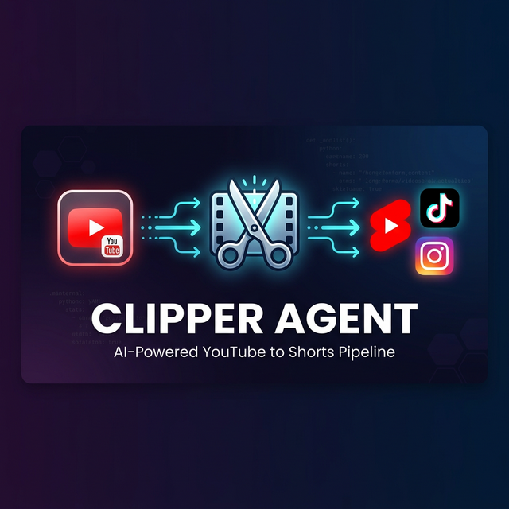
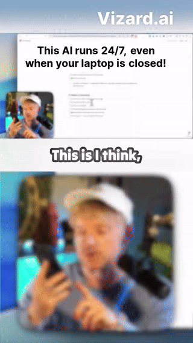
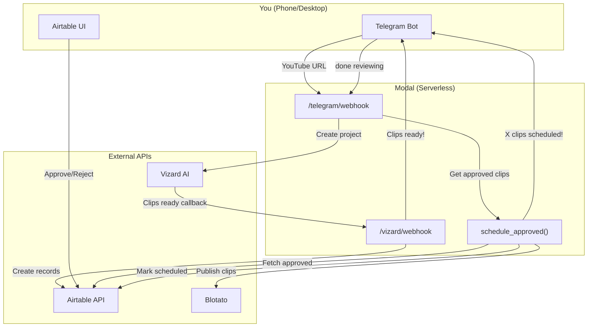

<p align="center">
  
</p>

<h1 align="center">Clipper Agent</h1>

<p align="center">
  <b>AI-powered YouTube → Shorts/Reels pipeline</b><br>
  Send a YouTube URL via Telegram → get AI-generated clips in Airtable → approve → auto-publish to YouTube Shorts
</p>

<p align="center">
  
</p>

<p align="center">
  
  
  
</p>

---

## How It Works

```
You (Telegram)          Modal (Cloud)           External APIs
      │                      │                       │
      │── YouTube URL ──────>│                       │
      │<── "Processing!" ────│                       │
      │                      │── Create project ──> Vizard AI
      │                      │                       │
      │               (1-5 min wait)                 │
      │                      │                       │
      │                      │<── Clips ready ────  Vizard AI
      │                      │── Create records ──> Airtable
      │<── "10 clips ready!" │                       │
      │                      │                       │
 (You review in Airtable, approve/reject clips)      │
      │                      │                       │
      │── "done reviewing" ─>│                       │
      │                      │── Get approved ────> Airtable
      │                      │── Publish clips ──-> Blotato
      │<── "5 scheduled!" ───│                       │
```

### Two Workflows

| # | Trigger | What happens |
|---|---------|-------------|
| **1** | Send a YouTube URL | Vizard AI clips the video → clips land in your Airtable with viral scores |
| **2** | Send "done reviewing" | Approved clips get published to YouTube Shorts via Blotato |

---

## Quick Start

### Prerequisites

- Python 3.11+
- A [Modal](https://modal.com) account (free — $30/mo credits)
- API keys for: [Vizard AI](https://vizard.ai), [Telegram Bot](https://t.me/BotFather), [Airtable](https://airtable.com), [Blotato](https://blotato.com) (optional)

### 1. Download & Install

**Option A: Git Clone**
```bash
git clone https://github.com/Rameh-Kumar/Clipper-Agent.git
cd Clipper-Agent
pip install -r requirements.txt
```

**Option B: Direct Download (ZIP)**
1. **[Click here to download the ZIP file directly](https://github.com/Rameh-Kumar/Clipper-Agent/archive/refs/heads/main.zip)**
2. Extract the downloaded folder.
3. Open a terminal inside the extracted folder and run:
   ```bash
   pip install -r requirements.txt
   ```

### 2. Get Your API Keys

<details>
<summary><b>🤖 Telegram Bot Token</b></summary>

1. Open Telegram and search for **@BotFather**
2. Send `/newbot`
3. Follow the prompts to name your bot
4. Copy the **API Token** (looks like `123456:ABC-DEF...`)

</details>

<details>
<summary><b>🎬 Vizard API Key</b></summary>

1. Go to [vizard.ai](https://vizard.ai) and sign up
2. Click your profile icon → **Workspace Settings**
3. Click the **API** tab
4. Click **Generate API Key**

</details>

<details>
<summary><b>📊 Airtable PAT & Base ID</b></summary>

1. Go to [airtable.com/create/tokens](https://airtable.com/create/tokens)
2. Click **Create token**
3. Add scopes: `data.records:read`, `data.records:write`, `schema.bases:read`
4. Select your base → **Create token**
5. Your **Base ID** is in the URL: `https://airtable.com/appXXXXXXX/...` (the `app...` part)

</details>

<details>
<summary><b>📱 Blotato API Key (Optional)</b></summary>

1. Go to [app.blotato.com](https://app.blotato.com)
2. **Settings → API → Generate API Key**
3. Connect your YouTube channel in Blotato settings

</details>

<details>
<summary><b>🔒 Your Telegram Chat ID</b></summary>

1. Deploy the bot **without** a `TELEGRAM_CHAT_ID` first
2. Send any message to your bot
3. Check the Modal logs — it will print: `👉 TIP: Your Chat ID is XXXXXXX`
4. Add that number as `TELEGRAM_CHAT_ID` in your secrets

</details>

### 3. Set Up Airtable

Create a table called **`shorts/Reel`** with these columns:

| Column | Type | Description |
|--------|------|-------------|
| Title | Single line text | AI-generated clip title |
| Video | Attachment | The clip video file |
| Caption | Long text | Transcript/caption |
| Viral Score | Number | AI engagement score (0-10) |
| Viral Reason | Long text | Why it scored high |
| Source URL | URL | Original YouTube video |
| Status | Single select | Options: `Ready`, `Approved`, `Rejected` |

### 4. Configure Modal Secrets

```bash
# Authenticate with Modal
modal token new

# Create your secrets
modal secret create vizard-clipper-secrets \
  VIZARD_API_KEY="your_vizard_key" \
  TELEGRAM_BOT_TOKEN="your_telegram_token" \
  AIRTABLE_PAT="your_airtable_pat" \
  AIRTABLE_BASE_ID="appXXXXXXXXXXX" \
  AIRTABLE_TABLE_NAME="shorts/Reel" \
  TELEGRAM_CHAT_ID="your_chat_id" \
  BLOTATO_API_KEY="your_blotato_key" \
  BLOTATO_YOUTUBE_ACCOUNT_ID="your_account_id" \
  MODAL_APP_URL="https://your-workspace--clipper-agent-fastapi-app.modal.run"
```

### 5. Deploy

```bash
modal deploy vizard_clipper.py
```

You'll see output like:
```
✓ Created web function fastapi_app =>
    https://your-workspace--clipper-agent-fastapi-app.modal.run
✓ App deployed! 🎉
```

### 6. Register Telegram Webhook

```bash
# Register webhook
curl "https://api.telegram.org/bot<YOUR_TOKEN>/setWebhook?url=<YOUR_MODAL_URL>/telegram/webhook"

# Verify it's registered
curl "https://api.telegram.org/bot<YOUR_TOKEN>/getWebhookInfo"
```

### 7. Test It! 🎉

1. Open your bot on Telegram
2. Send `/start` — you should get a welcome message
3. Send a YouTube URL — Vizard will start processing
4. Check your Airtable — clips will appear in 1-5 minutes
5. Approve some clips by changing their Status to "Approved"
6. Send `done reviewing` — approved clips get scheduled!

---

## Bot Commands

| Command | What it does |
|---------|-------------|
| Any YouTube URL | Starts clip generation (Workflow 1) |
| `done reviewing` or `/done` | Schedules approved clips (Workflow 2) |
| `/status` | Shows pending/approved clip counts |
| `/start` or `/help` | Shows available commands |

---

## Project Structure

```
clipper-agent/
├── vizard_clipper.py         # Modal entry point (deploy this)
├── app/
│   ├── __init__.py
│   ├── main.py               # FastAPI endpoints + orchestration
│   ├── telegram_bot.py       # Telegram message parsing & sending
│   ├── vizard_client.py      # Vizard AI API client
│   ├── airtable_client.py    # Airtable CRUD operations
│   └── blotato_client.py     # Blotato publishing client
├── test_vizard.py            # Standalone Vizard API test script
├── .env.example              # Template for environment variables
├── requirements.txt
└── README.md
```

---

## Architecture



---

## Security

- **Chat ID Lock**: Only your Telegram account can interact with the bot. Set `TELEGRAM_CHAT_ID` in your Modal secrets.
- **No hardcoded secrets**: All API keys are stored as Modal Secrets, never in code.
- **Webhook validation**: Only processes valid Telegram webhook payloads.

---

## Cost

| Service | Monthly Cost | What You Get |
|---------|:-----------:|-------------|
| Vizard Creator | $29 | 600 credits/mo (~15 videos) |
| Blotato Starter | $29 | 1,250 credits, 20 accounts |
| Modal | **Free** | $30 free credit (plenty) |
| Telegram | **Free** | Unlimited |
| Airtable Free | **Free** | 1,000 records, 1GB storage |
| **Total** | **~$58/mo** | |

---

## Testing Locally (Preview Generated Clips)

Since the main agent relies on webhooks and Airtable to orchestrate videos, the clips are **never downloaded to your computer** when running in the cloud. They go straight into your Airtable!

However, if you want to test the Vizard AI quality *before* setting up all the databases and deploying to Modal, you can use the included test script.

1. Open `test_vizard.py` in your code editor.
2. At the top of the file, insert your Vizard API Key and a YouTube URL.
3. Run the script:
   ```bash
   python test_vizard.py
4. The script will wait for Vizard to process the video, and then **download the `.mp4` clips locally** into a new `clips/` folder on your computer so you can watch them! It will also save the full API response in `clips/_metadata.json`.

---

## Customization

### Change clip settings
Edit `app/vizard_client.py` → `create_project()` payload:
- `preferLength`: `[1]`=15-30s, `[2]`=30-60s, `[3]`=1-3min
- `ratioOfClip`: `1`=9:16 (vertical), `2`=16:9 (horizontal), `3`=1:1 (square)
- `subtitleSwitch`: `1`=ON, `0`=OFF
- `lang`: `"en"`, `"hi"`, `"es"`, etc.

### Add a branded template
1. Create a project in Vizard, customize subtitles/layout
2. Save as Template, copy the Template ID from the URL
3. Add `VIZARD_TEMPLATE_ID=your_id` to Modal secrets

### Change Airtable table
Set `AIRTABLE_TABLE_NAME` in your Modal secrets to any table name.

---

## Contributing

Pull requests welcome! If you have ideas for improvements:
1. Fork the repo
2. Create a feature branch
3. Submit a PR

---

## License

MIT — use it however you want.
